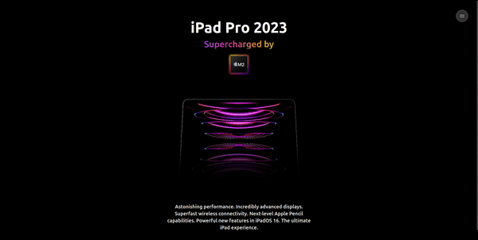

markdown

# Animation Landing Page



## Description

This project is a landing page implemented using Next.js, Tailwind CSS, and Framer Motion. It serves as a clone for the Apple website, focusing on animations and modern web design techniques.

## Features

- Responsive design for various screen sizes.
- Smooth animations created with Framer Motion.
- Next.js for efficient and fast web development.
- Tailwind CSS for easy styling and customization.

## Project Structure

```plaintext
animation-landing-page/
├── public/
│   ├── index.html
│   ├── favicon.ico
│   └── ...
├── src/
│   ├── components/
│   │   └── NavBar.tsx
│   ├── pages/
│   │   ├── api/...
├── │   ├── _app.tsx
│   │   ├── index.tsx
│   │   └── _document.tsx
│   └── styles/
│       └── global.css
│       
│   
├── .gitignore
├── next.config.js
├── package.json
├── tsconfig.json
├── README.md
└── tailwind.css
``````
## Installation

Before you start, make sure you have Node.js and npm installed on your machine.

1. Clone the repository:

   ```bash
   git clone https://github.com/redaezziani/animation-landing-page.git

    Change into the project directory:

    bash

cd animation-landing-page

Install dependencies:

bash

npm install

Run the development server:

bash

    npm run dev

    The project will be accessible at http://localhost:3000.
```

Usage

Feel free to explore, modify, and extend the project as needed. Customize the content, colors, and animations to suit your preferences and requirements.
Contributing

If you'd like to contribute to this project, please follow the standard GitHub Fork and Pull Request workflow.
License

This project is licensed under the MIT License.
Acknowledgments

    Next.js
    Tailwind CSS
    Framer Motion

Happy coding! 🚀


